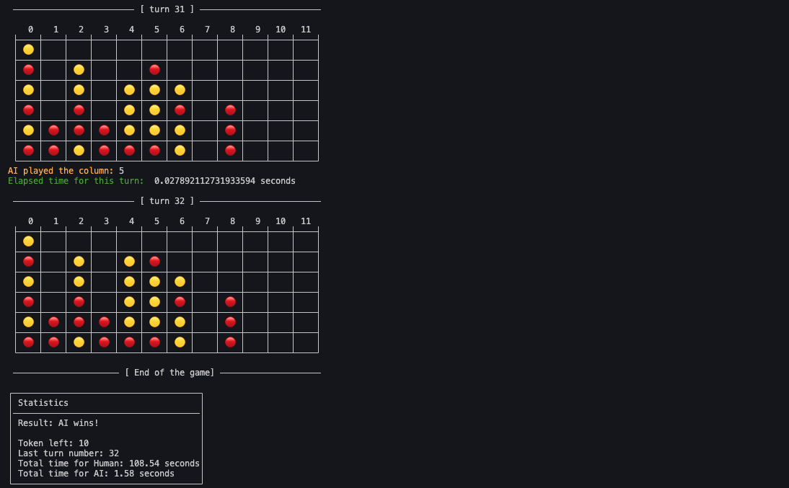

# Connect-4

> A simple connect-4 game built with python and blessed.



## Getting Started

### Prerequisites

- [Python 3.9+](https://www.python.org/downloads/)
- [Pip](https://pip.pypa.io/en/stable/getting-started/)
- [Git](https://git-scm.com/downloads)

### Install

To install the game, start by cloning the repository:

```bash
git clone https://github.com/MorganKryze/Connect-4.git
```

Then, install the dependencies:

```bash
pip install -r requirements.txt
```

### How to use

To start the game, run the following command:

```bash
python src/main.py
```

Then use the arrow keys and enter to navigate the menu, and play the game using your numpad.

### Configuration

You can change the game settings by editing the `constants.py` file in the modifiable section (number of columns, lines or tokens available).

## Authors

- [**Morgan Kryze**](https://github.com/MorganKryze)
- [**MailiTurong**](https://github.com/MailiTruong)
- [**sheesh3218**](https://github.com/sheesh3218)

## License

This project is licensed under the MIT License - see the [LICENSE](LICENSE) file for details.
